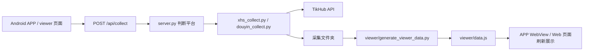
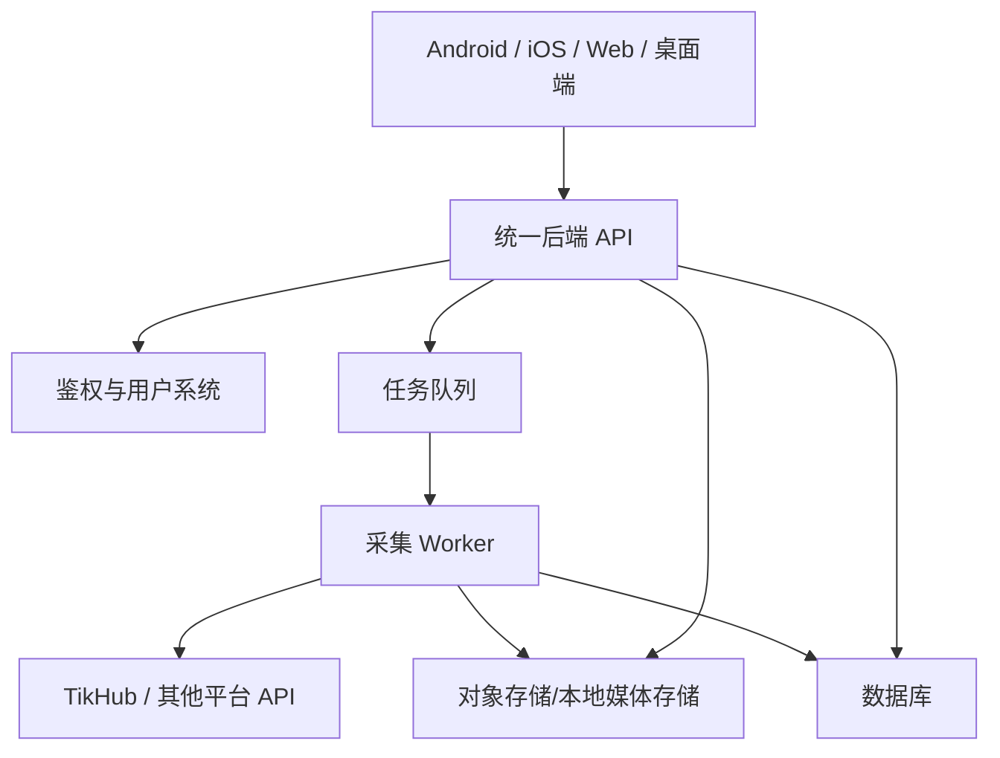

# social-media-claw

社媒内容采集与浏览工具。当前项目由三部分组成：

- `server.py`：本地/服务器端入口，提供 Web 浏览页、APP API、采集接口和 APK 更新信息。
- `viewer/`：网页端内容浏览与手动采集页面。
- `android-app/`：Android 客户端，负责登录服务器、浏览内容、接收系统分享并调用后端采集。
- `xhs-tikhub-collector/`、`douyin-tikhub-collector/`：通过 TikHub API 采集小红书/抖音内容。

> 重要：写文件和改文档时注意编码，统一使用 UTF-8，避免中文目录名和中文内容出现乱码。

## 先记住这件事

APP 采集失败时，第一优先检查服务端有没有配置 TikHub API Key。

采集脚本需要读取下面任意一个环境变量：

```env
TIKHUB_API_KEY=你的_TikHub_API_Key
# 或
TIKHUB_TOKEN=你的_TikHub_Token
```

推荐在项目根目录创建本地 `.env`：

```text
E:\code vibe coding\social-media-claw\.env
```

内容示例：

```env
TIKHUB_API_KEY=替换成真实_key
```

也可以放到：

```text
E:\code vibe coding\social-media-claw\xhs-tikhub-collector\.env
```

`server.py` 查找顺序是：

1. `LINK_TIKHUB_ENV_FILE` 指定的文件。
2. 项目根目录 `.env`。
3. `xhs-tikhub-collector/.env`。

`.env` 已经在 `.gitignore` 里，不要提交真实 key。

## 启动服务端

默认启动：

```bash
python server.py
```

默认监听：

```text
http://127.0.0.1:8899/viewer/
```

如果要给手机 APP 访问，需要监听公网或局域网地址，例如：

```bash
python server.py 8899 0.0.0.0
```

常用服务端环境变量：

```env
# Web/API Basic Auth，不设置则不启用鉴权
LINK_VIEWER_USER=admin
LINK_VIEWER_PASSWORD=你的访问密码

# 指定 TikHub env 文件，适合部署服务器时把 key 放到固定路径
LINK_TIKHUB_ENV_FILE=E:\path\to\.env

# APP 更新信息
LINK_APP_LATEST_VERSION_CODE=11
LINK_APP_LATEST_VERSION_NAME=1.10
LINK_APP_MIN_VERSION_CODE=11
LINK_APP_UPDATE_TITLE=发现新版本
LINK_APP_UPDATE_MESSAGE=当前版本需要更新后继续使用。

# 如果 APK 不由本服务托管，可以显式指定下载地址
LINK_APP_DOWNLOAD_URL=https://example.com/social-media-claw.apk
```

## APP 需要单独设置

Android APP 不是直接填 TikHub API Key。TikHub Key 只放服务端。

APP 登录页需要确认三项：

1. 服务器地址：例如 `http://49.51.72.63` 或 `http://你的域名:8899`。
2. 用户名：对应服务端 `LINK_VIEWER_USER`，默认代码里只是占位值。
3. 密码：对应服务端 `LINK_VIEWER_PASSWORD`。

APP 内部会调用：

- `GET /healthz`：检查服务器和账号密码是否可用。
- `GET /api/app-version`：检查是否需要强制更新。
- `POST /api/collect`：把分享文本发给服务端采集。
- `/viewer/`：展示网页内容。

如果 APP 显示采集失败，按这个顺序查：

1. 分享内容是不是具体作品链接/口令，不要只粘 `https://www.xiaohongshu.com/` 首页。
2. 服务端 `.env` 里有没有 `TIKHUB_API_KEY`。
3. APP 的服务器地址是否能访问 `/healthz`。
4. APP 登录用户名/密码是否和服务端 Basic Auth 一致。
5. 服务端是否正在运行，端口是否被防火墙或云安全组放行。

## 当前采集流程



采集产物会写入：

```text
采集文件夹/
```

Web 数据索引会生成到：

```text
viewer/data.js
```

## 多端服务化备忘

后面如果要做成多端服务，不建议让每个客户端直接知道 TikHub Key，也不要把采集逻辑塞进 APP。更稳的方向是做一个后端分发层：



建议演进顺序：

1. 保留 `server.py` 作为最小可用服务，先把当前 APP 跑稳定。
2. 把 `/api/collect` 从同步执行改成任务模型：提交任务后返回 `task_id`。
3. 新增任务状态接口：`GET /api/tasks/:id`。
4. 用数据库保存用户、采集记录、媒体索引、失败原因。
5. 媒体文件迁移到对象存储或独立静态服务，避免 APP 直接依赖服务器本地路径。
6. 多端统一走同一套 API，客户端只保存服务器地址和登录态。
7. TikHub Key、平台 Cookie、代理、限流策略全部留在服务端。

未来可以拆成这些模块：

- API Gateway：统一鉴权、限流、版本管理。
- Collector Service：负责小红书/抖音等平台采集。
- Task Queue：负责排队、重试、失败记录。
- Media Service：负责图片/视频下载、转码、音频抽取。
- Content DB：负责内容、作者、标签、采集状态。
- Admin Console：管理 key、任务、用户和更新包。

## Android 构建

进入 Android 项目：

```bash
cd android-app
./gradlew assembleDebug
```

Windows PowerShell 下通常是：

```powershell
cd android-app
.\gradlew.bat assembleDebug
```

发布前检查：

- 不要提交真实 API key、token、私钥、`local.properties`。
- 确认 APP 默认服务器地址是否要改。
- 确认 `versionCode`、`versionName` 是否递增。
- 如果启用强制更新，确认 `/downloads/social-media-claw-debug.apk` 或 `LINK_APP_DOWNLOAD_URL` 可访问。

## 常见问题

### 采集提示没有配置 TIKHUB_API_KEY

服务端没有读到 key。创建或检查 `.env`，然后重启 `server.py`。

### APP 登录失败

先用浏览器访问：

```text
http://服务器地址/healthz
```

如果服务端配置了 `LINK_VIEWER_PASSWORD`，浏览器或 APP 都需要 Basic Auth 用户名密码。

### APP 可以打开，但分享采集失败

确认分享文本是具体笔记/视频，不是平台首页。然后看服务端终端输出，常见原因是 TikHub key 缺失、TikHub 接口失败、链接平台识别失败或采集超时。

### 下载媒体失败

采集会默认下载媒体文件。若媒体 URL 下载失败，优先检查网络、超时、TikHub 返回的媒体 URL 可访问性，以及 `viewer/media_audit.json` 中的缺失项。
